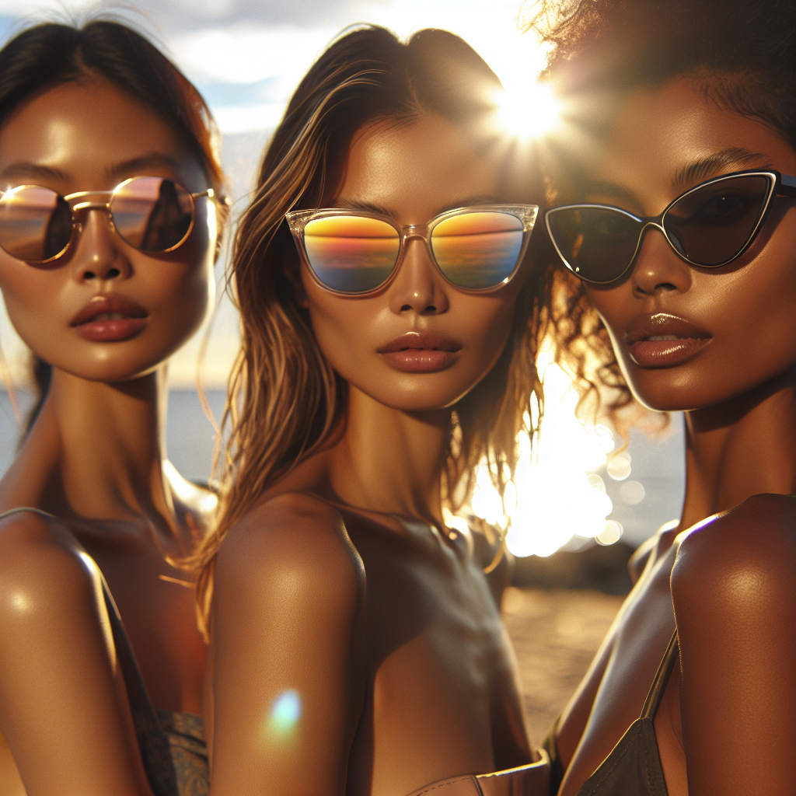

# 🕶️ Summer Sunglasses Campaign – Executive Summary

## 📊 Refined Trend Insights
Executive Summary  
For Summer 2026, we recommend anchoring your sunglasses line around three unmistakable fashion drivers—Oversized Statements, Sleek Metal Minimalism and Modernized Retro—then spotlighting one hero style from each category to deliver maximum impact in imagery, social media and in-store displays.

1. Trend Pillars  
   • Oversized Statement Silhouettes  
     Bold, butterfly- and square-style frames that read loud and clear—ideal for capturing attention.  
   • Sleek Metal & Wire Frames  
     Ultra-thin constructions and sculptural profiles that speak to a sophisticated, modern audience.  
   • Modernized Retro Shapes  
     Refined cat-eyes and boxy frames with subtle embellishments or color-pop lenses for a fresh yet familiar feel.

2. Hero Styles  
   • SG001 “Aviator”  
     Lightweight polished-metal frame + generous teardrop lenses = the season’s signature “polished modernity.” Easily customized with gradient or tinted lenses to suit regional preferences and price tiers.  
   • SG003 “Mystique”  
     A contemporary cat-eye with upward-swept corners and delicate temple detailing. It pairs sculptural femininity with the statement look summer shoppers crave.  
   • SG002 “Wayfarer” (optional)  
     Thick acetate, sharp angles and a nod to vintage cool. This style bridges the oversized‐statement trend and classic appeal—perfect for a broad demographic play.

3. Strategic Rationale  
   • Comprehensive Trend Coverage: Metal refinement (Aviator), sculptural flair (Mystique) and bold acetate (Wayfarer) ensure no customer segment is overlooked.  
   • Powerful Visual Storytelling: These three silhouettes translate seamlessly into striking hero images, dynamic social-media reels and influencer partnerships.  
   • Brand Leadership: Presenting a focused, trend-forward assortment reinforces your position as the go-to authority in summer eyewear.

Next Steps  
Finalize production runs, align color-lens options to regional data, and brief creative on hero-style visuals. With this targeted trio, your Summer 2026 campaign is poised to drive both buzz and sales.

## 🎯 Campaign Visual

    

## ✍️ Campaign Quote
Elevate Your Summer: Statement, Sleek, Modern Shades

## ✅ Why This Works
This phrase captures the image’s sun-drenched trio wearing bold acetate frames, ultra-thin metal silhouettes, and modernized cat-eye shapes, aligning perfectly with the oversized statement, sleek metal, and retro-revival trends for Summer 2026.

---

*Report generated on 2026-03-13*
